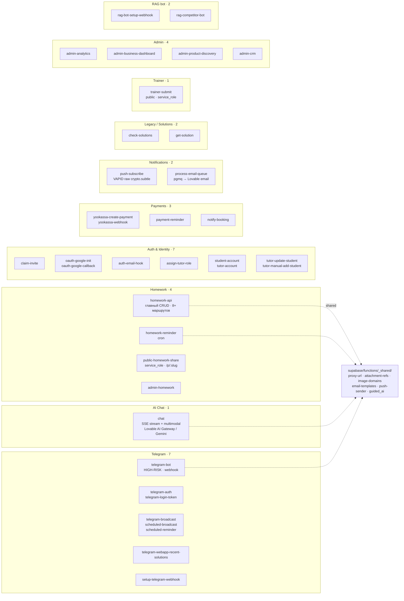
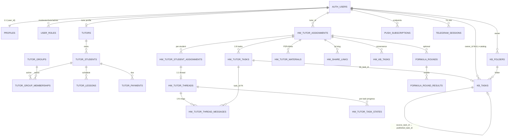
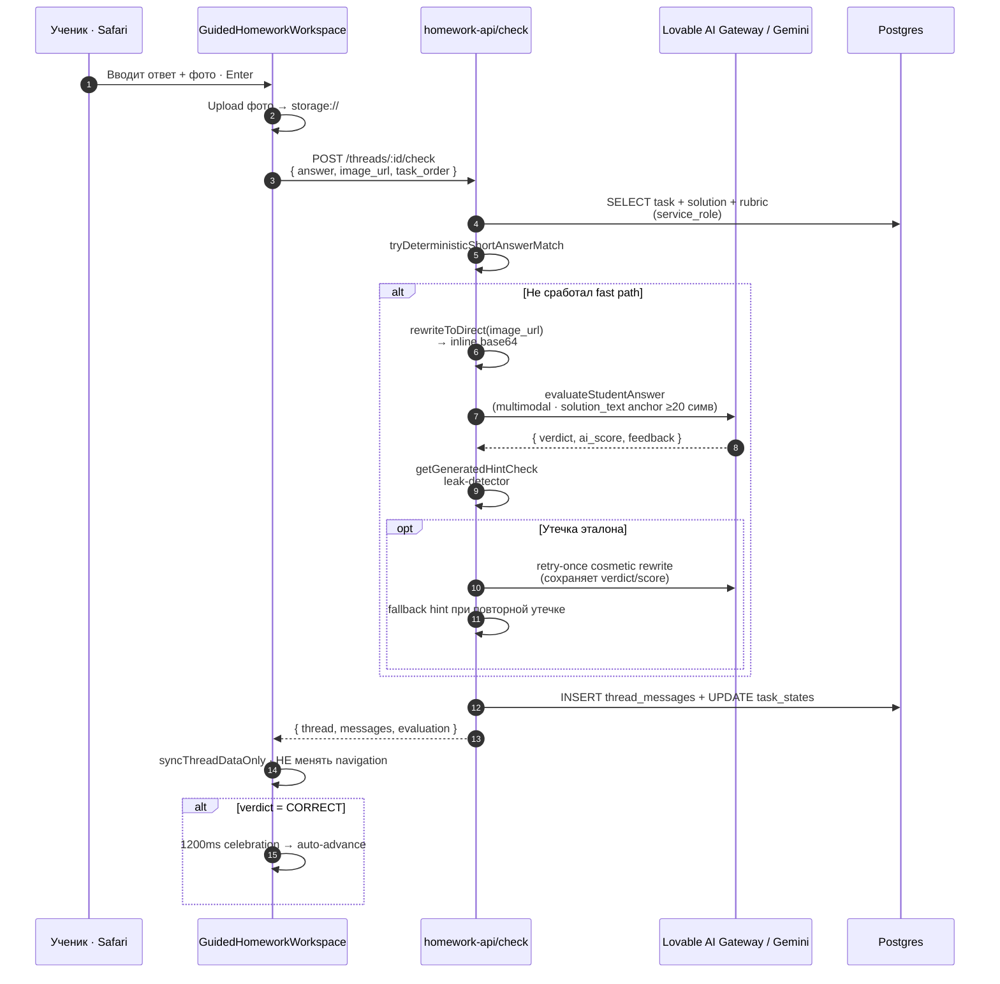
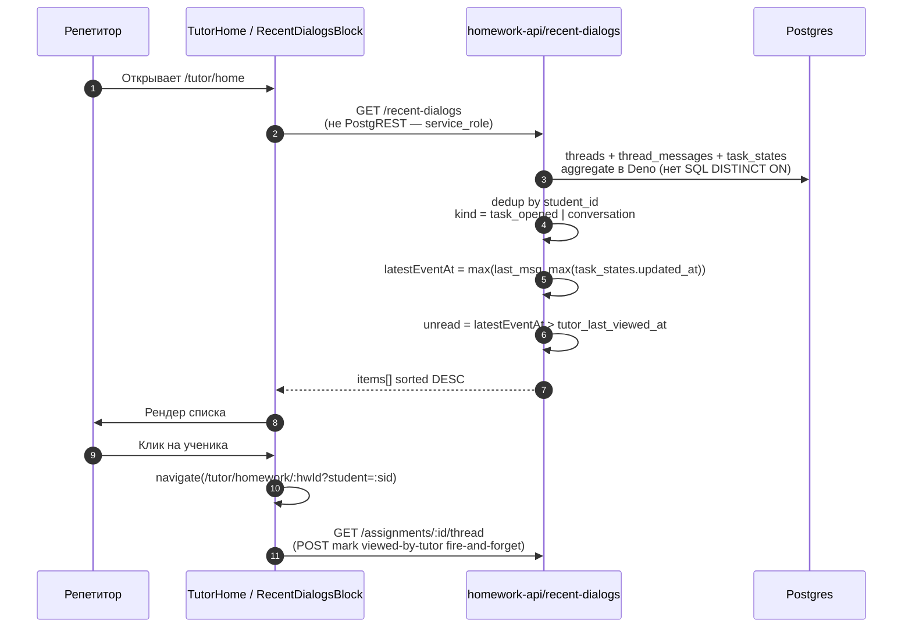
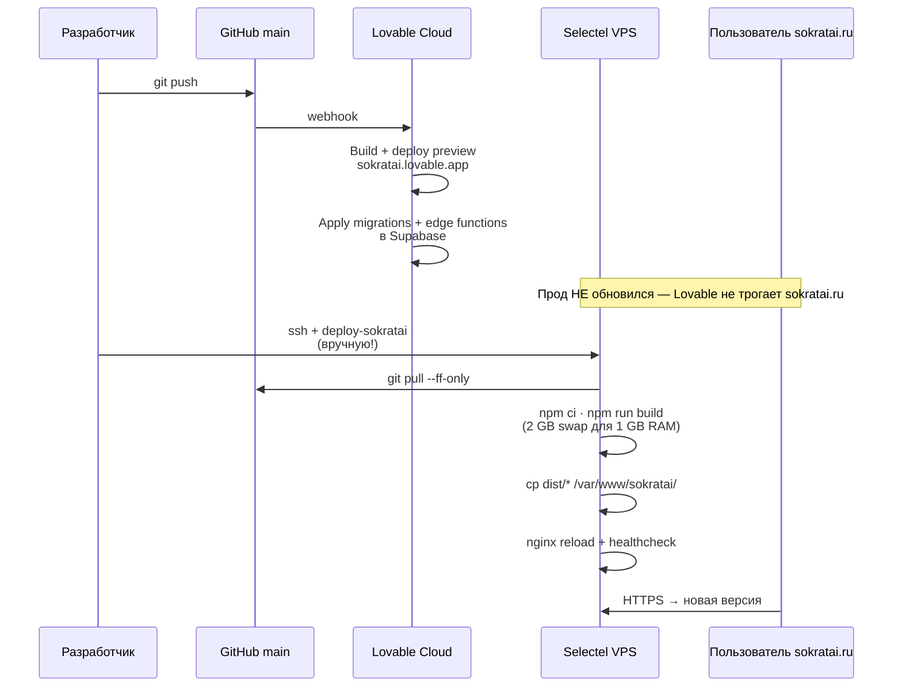

# Текущая архитектура SokratAI — 2026-05-07

Документ для совместного изучения с разработчиком: «как сейчас устроено» + «что стоит улучшить». Все диаграммы в Mermaid — рендерятся в GitHub, GitLab, Cursor preview, VSCode (с расширением Markdown Preview Mermaid Support).

> **Источники:** реальный inventory репозитория на 2026-05-07 (38 edge functions, ~45 страниц), `CLAUDE.md`, `.claude/rules/*`, история миграций. Ничего «от себя» не добавлено — только то, что есть в коде.

---

## TL;DR — три тезиса для разработчика

1. **Один монолитный SPA + 38 edge functions + один Postgres.** Backend-фреймворка нет; вся бизнес-логика в Deno-функциях Supabase. Это быстро для пилота, но создаёт скрытое связывание.
2. **Production-трафик идёт через свой VPS в Москве** (Selectel, `185.161.65.182`). Lovable Cloud — только preview. Любая правка фронта **не доходит до прода без ручного `deploy-sokratai`**.
3. **Главный тех-долг — `src/pages/Chat.tsx` (2000+ строк), двойной write-path в `homework_tutor_tasks` и отсутствие тестов** (только smoke-check). Архитектура держится на «greppable invariants» в CLAUDE.md, не на типах и тестах.

---

## 1. Сетевая инфраструктура

```mermaid
flowchart LR
  subgraph CF[Cloudflare DNS only — серое облако]
    DNS_S[sokratai.ru<br/>A → 185.161.65.182]
    DNS_API[api.sokratai.ru<br/>A → 185.161.65.182]
    DNS_LOV[sokratai.lovable.app<br/>preview — Lovable]
  end

  subgraph VPS["Selectel VPS Москва · 1 vCPU · 1 GB RAM<br/>Ubuntu 24.04 · nginx 1.24 · Let's Encrypt"]
    NGINX{nginx}
    STATIC[/var/www/sokratai/<br/>статический dist]
    DEPLOY[deploy-sokratai<br/>git pull → npm ci → build → reload]
  end

  subgraph SUPA["Supabase · vrsseotrfmsxpbciyqzc.supabase.co"]
    AUTH[Auth]
    REST[PostgREST]
    EF[Edge Functions Deno × 38]
    STORE[Storage]
    DB[(Postgres + RLS)]
    RT[Realtime]
  end

  USER_RU[Пользователь РФ<br/>Safari/Chrome] --> DNS_S
  USER_RU --> DNS_API
  USER_DEV[Разработчик / QA] --> DNS_LOV

  DNS_S --> NGINX
  DNS_API --> NGINX

  NGINX -->|/ → static| STATIC
  NGINX -->|/* reverse proxy| EF
  NGINX -->|/* reverse proxy| REST
  NGINX -->|/* reverse proxy| AUTH
  NGINX -->|/* reverse proxy| STORE

  DEPLOY -.git pull.-> GH[GitHub: main]
  GH -.push hook.-> LOV[Lovable Cloud<br/>авто-деплой preview + Supabase]
  LOV --> DNS_LOV
  LOV --> EF
  LOV --> DB

  EF --> DB
  REST --> DB
  AUTH --> DB
  RT --> DB
```

**Ключевые инварианты, которые ломать нельзя:**

- `https://api.sokratai.ru` **захардкожен** в `src/lib/supabaseClient.ts`. `import.meta.env.VITE_SUPABASE_URL` Lovable выставляет в прямой `*.supabase.co` (заблокирован РФ-провайдерами) — клиентский код намеренно его игнорирует.
- Signed URLs из edge functions, которые отдаются клиенту, **обязаны** проходить через `rewriteToProxy()` (`supabase/functions/_shared/proxy-url.ts`). Server-to-server fetch — через `rewriteToDirect()` для экономии 200-400 ms RU-roundtrip.
- Все signed-URL validators принимают **оба host** (direct + proxy) через OR. Нарушение → AI отвечает «ты прислал только условие, решения нет» (наблюдалось 2026-05-04, фикс PR #107).

---

## 2. Frontend — модули и routes

```mermaid
flowchart TB
  ROOT[src/main.tsx → App.tsx<br/>React Query + Router + lazy loading]

  ROOT --> PUBLIC
  ROOT --> AUTH_FLOW
  ROOT --> STUDENT
  ROOT --> TUTOR_FRAME
  ROOT --> TRAINER
  ROOT --> ADMIN
  ROOT --> SHARED

  subgraph PUBLIC[Публичные / без auth]
    P1[Index<br/>StudentLanding]
    P2[Login / SignUp / TutorLogin<br/>TutorSignupTrial]
    P3[InvitePage<br/>/invite/:code]
    P4[PublicHomeworkShare<br/>/p/:slug]
    P5[Offer / Privacy / Requisites]
    P6[Mock Exams public stubs<br/>/p/mock-invite/:slug<br/>/p/mock-result/:slug]
  end

  subgraph AUTH_FLOW[Auth & Routing]
    A1[AuthGuard<br/>HIGH-RISK]
    A2[TutorGuard<br/>HIGH-RISK · module-level cache]
    A3[SignupRouter / RedirectTutorAssistant]
  end

  subgraph STUDENT[Student domain · AuthGuard]
    S1[Chat.tsx · 2000+ строк<br/>HIGH-RISK · graph rendering · pyodide]
    S2[StudentHomework + StudentHomeworkDetail<br/>guided chat]
    S3[Progress / Practice / Diagnostic]
    S4[StudentMockExam + StudentMockExamResult<br/>/student/mock-exams/:id]
    S5[Profile · MiniApp · BookLesson]
  end

  subgraph TUTOR_FRAME[Tutor domain · AppFrame · TutorGuard]
    T1[TutorHome — dashboard]
    T2[TutorStudents + TutorStudentProfile]
    T3[TutorSchedule / TutorPayments]
    T4[TutorHomework hub]
    T5[TutorHomeworkCreate · Edit]
    T6[TutorHomeworkDetail · Heatmap · Drill-down]
    T7[TutorHomeworkPreview · /preview]
    T8[TutorHomeworkTemplates]
    T9[KnowledgeBasePage · CatalogTopicPage · FolderPage]
    T10[Mock Exams stubs<br/>gated by tutors.feature_mock_exams_enabled]
    T11[TutorAssistant · TutorProfile]
  end

  subgraph TRAINER[Trainer · standalone · без auth]
    TR1[TrainerPage<br/>formula engine клиент-сайд]
  end

  subgraph ADMIN[Admin · role check]
    AD1[Admin · CRM<br/>Business · Discovery]
    AD2[RetentionAnalysis]
  end

  subgraph SHARED[Shared infra]
    SH1[lib/supabaseClient<br/>HARDCODED url]
    SH2[lib/formatters<br/>date-fns parseISO]
    SH3[lib/attachmentRefs<br/>storage:// dual-format]
    SH4[hooks/useTutor*<br/>queryKey ['tutor', entity]]
    SH5[stores/hwDraftStore<br/>Zustand + localStorage]
    SH6[stores/trainerGamificationStore]
    SH7[components/ui<br/>shadcn/ui · Radix]
    SH8[components/kb/ui<br/>MathText lazy KaTeX]
  end
```

**Где живёт сложность:**

| Файл | Размер | Зачем нужен | Риск |
|---|---|---|---|
| `src/pages/Chat.tsx` | 2000+ строк | Generic AI-чат + Pyodide графики | **HIGH** — список запрещённых правок |
| `src/components/AuthGuard.tsx` + `TutorGuard.tsx` | small | Guard-логика | HIGH (module-level cache, не удалять) |
| `src/lib/tutorHomeworkApi.ts` | большой | Tutor API клиент | средний — типы дрейфуют от backend |
| `src/lib/studentHomeworkApi.ts` | средний | Student API клиент | средний — anti-leak invariant |
| `src/components/sections/tutor/ProductTour*.tsx` | средний | Лендинг trial | низкий, активно меняется |

---

## 3. Edge Functions — 38 штук, по доменам



**Самая большая функция — `homework-api`.** Внутри: `handleCreateAssignment`, `handleUpdateAssignment`, `handleGetResults`, `handleCheckAnswer`, `handleRequestHint`, `handleNotifyStudents`, `handleGetThread`, `handleGetRecentDialogs`, `handleSaveTasksToKB`, `handleCreateTemplateFromAssignment`, `handleGetAssignment`, share-links CRUD, … . Это де-факто backend целого homework-домена.

**`telegram-bot`** — отдельный мини-фреймворк: webhook routing, состояния `paym_*`, voice transcription через Groq Whisper, `fetchChatWithTimeout` ретраи, `mergeConsecutiveUserMessages`. Тоже под HIGH-RISK.

---

## 4. База данных — таблицы по доменам



**Главные boundary'и:**

- **Student/Tutor isolation** — нет таблицы где смешаны. Соединение только через `tutor_students` (репетитор привязал ученика). Нарушение запрещено правилом «Critical Architecture Rules» в `CLAUDE.md`.
- **KB Source→Copy model** — `kb_tasks WHERE owner_id IS NULL` = публичный каталог; `owner_id = user` = моя база. Триггеры `trg_kb_after_*` автоматически создают копии при перемещении в папку «сократ».
- **Anti-leak invariants** в SELECT-ах:
  - `handleGetStudentAssignment` НИКОГДА не селектит `solution_text` / `solution_image_urls` / `rubric_*`.
  - `public-homework-share` использует whitelist колонок, никогда `select("*")`.
  - `tutors` — узкая SELECT-policy `auth.uid() = user_id` (cross-user reads только через service_role + column whitelist; broad-policy откачена 2026-05-06).

---

## 5. Hot paths — критические user-flows

### 5.1 Ученик отвечает на задачу в guided chat



### 5.2 Репетитор открывает /tutor/home и видит «Последние действия»



### 5.3 Production deploy



---

## 6. Что можно улучшить — приоритизированно

### P0 — критическое, режет dev-velocity и/или ловится в проде

1. **Decompose `src/pages/Chat.tsx` (2000+ строк).**
   *Проблема:* HIGH-RISK файл, в котором смешаны: рендер сообщений, Pyodide-графики, обработка voice, маршрутизация tutor_score, guarding. Любое изменение требует ручного QA.
   *Что сделать:* выделить `ChatMessageList`, `ChatComposer`, `GraphRenderer` (уже частично), `useChatSession` хук. Pyodide вынести за `React.lazy` с явным fallback. Feature-flag для постепенного rollout.

2. **Автоматизировать deploy на Selectel VPS.**
   *Проблема:* любое FE-изменение требует SSH + `deploy-sokratai`. Уже два инцидента, когда забыли (см. `.claude/rules/95-production-deploy.md`).
   *Что сделать:* GitHub Actions workflow → rsync `dist/` на VPS после успешного build. Сохранить `deploy-sokratai` как manual fallback.

3. **Сократить двойной write-path в `homework_tutor_tasks`.**
   *Проблема:* Path A (edge function) и Path B (прямой `supabase.from(...).insert()` из `HWDrawer.tsx`) уже теряли поля (`solution_text` в коммите `adcdc12`, фикс `f454f6e`). Каждое новое поле требует помнить про оба пути.
   *Что сделать:* убрать прямой INSERT из `HWDrawer.tsx`, направить кнопку «В ДЗ» через `homework-api`. Type `HWDraftTask` → `CreateAssignmentTask` маппинг становится единственным.

4. **Минимальная test pyramid.**
   *Проблема:* `npm test` = `smoke-check`. Нет unit-тестов на anti-leak validators, на dual-host validator, на `parseAttachmentUrls`, на canonical token normalization formula engine.
   *Что сделать:* vitest + 30-50 unit-тестов на критические pure-функции. Это покроет ~80% historical regressions.

### P1 — заметные технические улучшения

5. **Type-safe API contract между FE и edge functions.**
   *Проблема:* TS-типы клиента (`tutorHomeworkApi.ts`, `studentHomeworkApi.ts`) и Deno-типы edge functions дрейфуют независимо. Compile-time не ловит mismatch — узнаём в проде.
   *Что сделать:* shared `supabase/functions/_shared/contracts.ts` с типами + import из `src/lib/contracts.ts`. Или Zod-схемы на границе.

6. **Версионирование bundle + force-update banner.**
   *Проблема:* пользователи сидят на старом SPA с устаревшими API-контрактами. Spec уже есть (`docs/delivery/features/service-worker-prod/spec.md` §5), не реализовано.
   *Что сделать:* `dist/version.json` + `versionCheck.ts` + emergency reload banner.

7. **Unify Telegram + Web invite flow.**
   *Проблема:* `claim-invite` логика дублирована между `InvitePage`, `Login`, `SignUp`, `TelegramLoginButton` (`claimPendingInvite` в каждом).
   *Что сделать:* hook `useInviteClaim()` + единый retry/cleanup-цикл.

8. **Decompose `homework-api/index.ts`.**
   *Проблема:* Один файл = 12+ handlers + AI logic + anti-leak + dual-host validators. ~3000+ строк.
   *Что сделать:* router-pattern — `handlers/checkAnswer.ts`, `handlers/recentDialogs.ts`, etc. Один `index.ts` только маршрутизация.

9. **Materialized views для tutor home + recent-dialogs.**
   *Проблема:* `handleGetRecentDialogs` каждый раз aggregates threads + messages + task_states в Deno (нет SQL DISTINCT ON). Это ОК на пилоте, не масштабируется.
   *Что сделать:* materialized view `mv_tutor_recent_dialogs` с refresh по триггеру.

10. **Real backend API gateway вместо nginx reverse proxy на /\*.**
    *Проблема:* nginx сейчас раздаёт фронтенд + проксирует ВСЁ на supabase.co. Нет своего API layer для бизнес-логики не привязанной к Supabase (rate limiting, audit log, custom auth).
    *Что сделать:* минимальный Bun/Hono service на VPS как middle-tier между nginx и Supabase для критических ручек (если возникнет такая бизнес-потребность). На сейчас не приоритет.

### P2 — постепенное улучшение DX и качества кода

11. **Storybook для shadcn/ui-обёрток + KB/Tutor компонентов.**
    *Проблема:* визуальная регрессия ловится только в Safari вручную.
    *Что сделать:* Storybook 8 + Chromatic / Percy.

12. **Удалить `framer-motion` запрет в CLAUDE.md → сделать ESLint правило.**
    *Проблема:* запреты в правилах — слабый контракт. Можно случайно вернуть.
    *Что сделать:* eslint-plugin-no-restricted-imports + no-restricted-syntax для `framer-motion`, `Inter font`, `Date(string)` (force `parseISO`).

13. **Бандл-анализ + tree-shaking.**
    *Проблема:* `npm run analyze` есть, но нет регулярной проверки. KaTeX/Pyodide — большие.
    *Что сделать:* CI step с лимитом размера + comparison к main.

14. **Migrate `useEffect` сложные эффекты → React Query / Zustand selectors.**
    *Проблема:* `TutorHomeworkCreate.tsx` имеет два связанных useEffect (reset/prefill) с критичным порядком объявления (см. правило 2026-04-17). Хрупко.
    *Что сделать:* внутри одного `useMemo` через React Query select-функцию.

15. **Стандартизировать telemetry.**
    *Проблема:* сейчас `console.info('[trainer-telemetry] ...')`, `console.warn(JSON.stringify(...))` для hint quality, `homework_share_link_visited` server-side console.warn. Нет единой схемы.
    *Что сделать:* `lib/telemetry.ts` + edge function `telemetry-collect`. Или интеграция с PostHog.

### P3 — продуктовые улучшения, попавшие в scope «архитектура»

16. **Tutor-side push opt-in UI.** Сейчас push subscription у репетиторов только через DevTools (см. `.claude/rules/95-production-deploy.md`).
17. **`/unsubscribe` route для email** — генерируется ссылка, страницы нет.
18. **Subject CHECK constraint sync** — каждое новое значение в `SUBJECTS` требует новой миграции. Уже было нарушение (commit `e57cada` → фикс `20260414150000`). Перевести на enum или whitelist в одном месте.

---

## 7. С чего начать разговор с разработчиком

Три фокусных вопроса, на которых стоит сосредоточить обсуждение:

1. **«Готовы ли мы сделать боль `Chat.tsx` приоритетом следующего спринта?»** — это самая большая HIGH-RISK зона. Decompose даст рост скорости остальных tutor/student изменений.
2. **«Нужны ли нам реальные unit-тесты или smoke-check + правил в CLAUDE.md достаточно?»** — критическая дискуссия. CLAUDE.md уже на 1500+ строк, новые agents не успевают читать всё.
3. **«Auto-deploy через GitHub Actions — сделаем сейчас или после стабилизации pilot?»** — низкоэффортная победа, но требует window когда можно сломать прод на 5 минут для setup.

---

## Связанные документы

- [Architecture Map for AI Agents](README.md)
- [High-risk zones](high-risk-zones.md)
- [Cloudflare proxy notes](cloudflare-proxy.md) (Phase A legacy, для отката)
- [Codebase overview](../overview/codebase.md)
- [Production deploy procedure](../../../.claude/rules/95-production-deploy.md)
