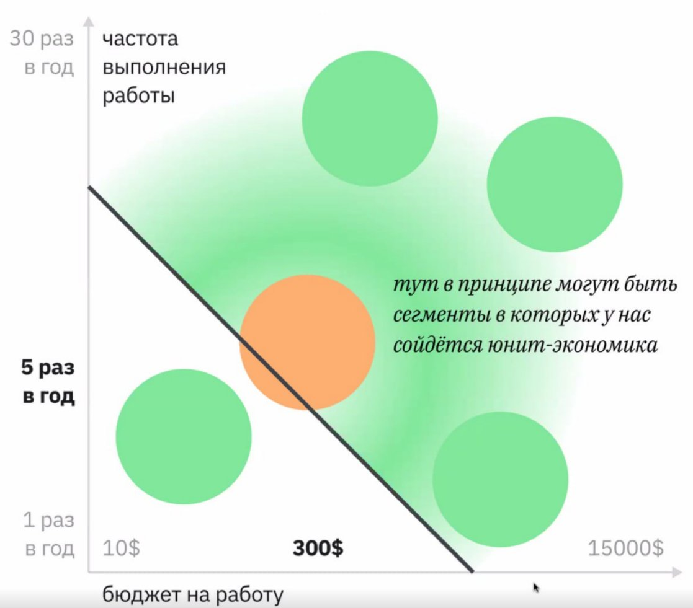
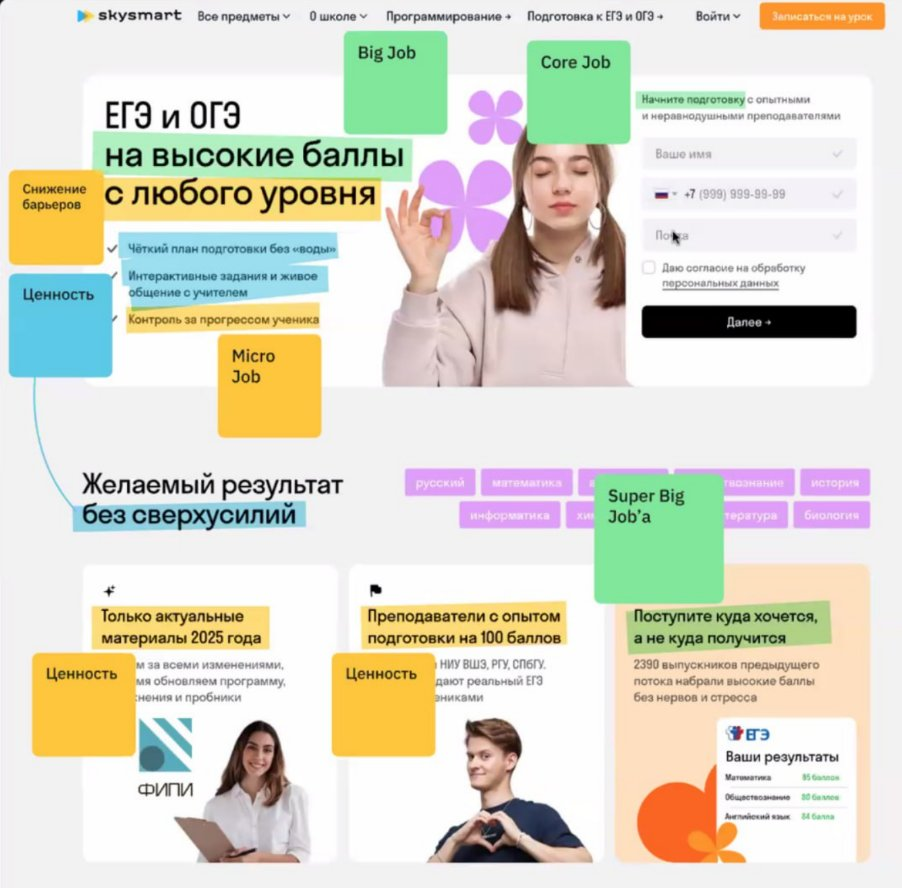

# AURA: Интегральный мета-фреймворк Ивана Замесина

## О документе

Описание AURA — интегрального мета-фреймворка Ивана Замесина, объединяющего четыре ключевых инструмента: Advanced JTBD, Unit Economics, Riskiest Assumption Test и ABCD-сегментацию. Документ объясняет, зачем нужна единая операционная система для синхронизации discovery, delivery, маркетинга и юнит-экономики, и как применять её на практике: расширенная цепочка валидации бизнеса, критерии выбора стратегии, матрица «частота × бюджет», шаблон лендинга и 8 формул рекламных заголовков на основе Jobs. Предыдущий документ `01-ajtbd-core-concepts-zamesin.md` — оба документа читаются последовательно.

---

## Содержание

- [Зачем нужен AURA](#зачем-нужен-aura)
  - [6 проблем синхронизации функций продукта](#6-проблем-синхронизации-функций-продукта)
- [Что такое AURA](#что-такое-aura)
  - [Компоненты AURA](#компоненты-aura)
  - [Что покрывает AURA (полный набор)](#что-покрывает-aura-полный-набор)
  - [Дисклеймер от Замесина](#дисклеймер-от-замесина)
- [AJTBD как основа синхронизации](#ajtbd-как-основа-синхронизации)
  - [Расширенная цепочка валидации бизнеса (через AURA)](#расширенная-цепочка-валидации-бизнеса-через-aura)
- [Стратегия продукта через AJTBD](#стратегия-продукта-через-ajtbd)
  - [Фундаментальное решение продуктовой стратегии](#фундаментальное-решение-продуктовой-стратегии)
  - [Дополнительные стратегии создания ценности](#дополнительные-стратегии-создания-ценности-к-9-из-doc-01)
  - [«Пилить фичи» vs «Применять стратегии»](#пилить-фичи-vs-применять-стратегии)
- [Информация для определения стратегии](#информация-для-определения-стратегии)
  - [4 источника данных](#4-источника-данных)
  - [3 критерия оценки стратегической возможности](#3-критерия-оценки-стратегической-возможности)
  - [Матрица выбора сегмента: частота × бюджет](#матрица-выбора-сегмента-частота--бюджет)
- [Структура лендинга на базе Jobs (шаблон Замесина)](#структура-лендинга-на-базе-jobs-шаблон-замесина)
  - [Верхняя часть (first screen)](#верхняя-часть-first-screen)
  - [Средняя часть](#средняя-часть)
  - [Нижняя часть](#нижняя-часть)
  - [8 формул заголовков баннеров (реклама)](#8-формул-заголовков-баннеров-реклама)
  - [Пример разбора: SkySmart](#пример-разбора-skysmart-егэогэ-лендинг)
- [Полная карта AJTBD (состав методологии)](#полная-карта-ajtbd-состав-методологии)
- [Связь с предыдущим документом](#связь-с-предыдущим-документом)

---

> Источник: воркшоп 10.11.2025
> Автор: Иван Замесин (zamesin.ru/producthowto)
> Предыдущий документ: `01-ajtbd-core-concepts-zamesin.md`

---

## Зачем нужен AURA

Продукт — единый, сложный организм. Но существующие фреймворки решают каждый свою узкую задачу: изучить потребности, создать ценность, сделать воронку, посчитать юнит-экономику, спроектировать интерфейс. **Не существовало интегрального инструмента**, способного свести всё в единую систему.

### 6 проблем синхронизации функций продукта

1. Исследователи сделали исследование, продакты пошли пилить фичи из головы (стейкхолдера)
2. Продакты и исследователи нашли сегменты, маркетологи не знают как привлечь этих людей
3. Реализовали фичу, никто не понимает как и кому её продавать
4. Компания постоянно теряет фокус, делает всё для всех
5. Интересы и цели сейлзов противоречат интересам и целям продукта, маркетинга, операционки
6. Бренд- и маркетинговая стратегии делаются в отрыве от продуктовой стратегии

---

## Что такое AURA

AURA — акроним четырёх главных фреймворков, объединённых в операционную систему для принятия **всех** стратегических и тактических решений в продукте.

### Цели интегрального мета-фреймворка

1. **Связать discovery, delivery, маркетинг и бренд:** исследования, выбор сегмента и джобов превращаются в продукт и коммуникацию без разрывов и расфокусировки
2. **Синхронизировать целеполагание разных функций компании**
3. **Фокусировать ресурсы компании**
4. **Связать всё это с юнит-экономикой и P&L**
5. **В итоге, давать алгоритмы для решения всех ежедневных задач**

### Компоненты AURA

| Компонент | Назначение |
|-----------|-----------|
| **A — Advanced JTBD** | Изучение и структурирование задач людей, сегментация, создание и донесение ценности, стратегические решения |
| **U — Unit Economics** | Бизнес-модель, денежный движок. Как продукт преобразует лидов в прибыль |
| **R — Riskiest Assumption Test** | Выделение ключевых предположений с рисками, ранжирование, проверка того риска, который может убить инициативу |
| **A — ABCD-сегментация** | Сегментация по маржинальности и удовлетворённости, чтобы не тратить ресурсы на тех клиентов, на которых не заработаем |

**Дополнительно включает:** приоритизацию беклогов, способ сохранять фокус, алгоритмы формирования стратегии, P&L и многое другое.

### Что покрывает AURA (полный набор)

Продукт в рамках AURA решает задачи по 9 направлениям:

1. Решает задачи клиентов
2. Решает задачи бизнеса
3. Discovery: исследования
4. Бизнес-модель и юнит-экономика
5. Процесс проверки гипотез
6. Фокусировка
7. Стратегия
8. Целеполагание
9. Delivery: проектирование, реализация, контроль качества

### Дисклеймер от Замесина

- AJTBD и AURA **не требуют забыть всё**, что вы знали до этого
- CJM, кастдев, проблемные интервью, фичи — **это часть AJTBD**
- AJTBD был нужен **для того**, чтобы на его основе можно было сделать интегральный мета-фреймворк

---

## AJTBD как основа синхронизации

### Расширенная цепочка валидации бизнеса (через AURA)

```
На рынке достаточно денег для наших амбиций [1%, 5%, 10% рынка]
    ↓
Есть достаточно большие сегменты клиентов и их работы,
для которых мы можем создать добавочную ценность, чтобы иметь шанс на продажи
    ↓
Мы в теории можем получать целевую маржу на юнит
+ в теории есть каналы привлечения, в которых мы можем привлекать
нужный объём лидов с нужной стоимостью
    ↓
Мы доказали, что клиенты покупают наш продукт и мы знаем эту ценность
    ↓
На потоке клиентов мы доказали, что получаем целевую маржу на юнит
    ↓
На потоке клиентов мы способны привлекать нужное количество клиентов
с целевой стоимостью и качеством
    ↓
Мы способны конвертировать их в оплату / повторные оплаты
    ↓
Мы получаем целевую прибыль
```

**Отличие от упрощённой цепочки** (doc 01): здесь добавлены шаги про теоретическую валидацию юнит-экономики и каналов ДО доказательства покупок, а также привязка к конкретным % рынка.

---

## Стратегия продукта через AJTBD

### Фундаментальное решение продуктовой стратегии

**За какую работу мы будем конкурировать + почему мы победим в конкуренции за эту работу.**

### Дополнительные стратегии создания ценности (к 9 из doc 01)

**Напоминать к какой пользе и ценности ты идёшь** — показывать Core Job → Job/Solution Benefits (создать ценность)

**Напоминать к какой точке Б ты идёшь** — визуализация конечного состояния (создать ценность)

**Заставить проинвестировать в наш продукт**, чтобы он бессознательно боялся потерять инвестицию — регистрация, профиль, данные → точка A → инвестиции в продукт → точка Б (вырастить конверсию)

**Масштабировать продукт на +1 сегмент** для фундаментально тех же Core Job'ов — базовая стратегия. Пример: Яндекс.Такси — «Недорого добраться из А в Б» (Эконом) → «С комфортом» (Комфорт) → «Статусно и с комфортом» (Ultima, +1 сегмент)

### «Пилить фичи» vs «Применять стратегии»

| Пилить фичи и чинить боли | Применять стратегии |
|---|---|
| Opportunity cost **неизвестен** | Opportunity cost **известен и минимизируем** |
| По-факту: адовый | Механики выхода из конкуренции |

---

## Информация для определения стратегии

### 4 источника данных

1. **AJTBD-исследование** для изучения графов работ рядом с Core Jobs наших И конкурентов + количественная валидация сегментов и позиций конкурентов
2. **Кабинетная аналитика** рынка, трендов, регуляции, прогнозов
3. **Экспертные интервью про возможности:** недооценённые сегменты, гипотезы ценности
4. **Анализ** компетенций, доступных ресурсов и принципов принятия решений конкурентов

### 3 критерия оценки стратегической возможности

**1. Возможность создать более ценное решение:**
- Core Jobs + Big Jobs + барьеры + привычка
- Решения, которые нанимаются на эти работы
- Необходимые ресурсы и компетенции + наличие у нас этих ресурсов

**2. Возможность получить целевую прибыль на юнит:**
- Особенности людей/компаний в зависимости от выбранной бизнес-модели

**3. Возможность масштабироваться в сегменте:**
- Размер сегмента
- Возможность создать спрос
- Small Jobs, которые можем делать своими Core Jobs

### Матрица выбора сегмента: частота × бюджет

Два измерения для оценки привлекательности сегмента:
- **Ось Y:** частота выполнения работы (1 раз/год → 30 раз/год)
- **Ось X:** бюджет на работу ($10 → $15,000)
- **Диагональ:** граница юнит-экономики (например, $300/год)
- **Зелёная зона** (выше диагонали): сегменты, где юнит-экономика может сойтись
- **Оранжевая зона** (ниже): сегменты, где юнит-экономика под вопросом



---

## Структура лендинга на базе Jobs (шаблон Замесина)

### Верхняя часть (first screen)

| Элемент | Формула |
|---------|---------|
| **Oneliner** | Кратко: кто мы + какие Core Job'ы закрываем + за счёт каких невероятных выполненных работ |
| **Заголовок** | Core Job + ценность + за счёт каких фич |
| **Подзаголовок** | Micro Job 1, Micro Job 2, Micro Job 3 |
| **Call To Action** | [Выполнить самую легко реализуемую одну из первых Micro Job] |

### Средняя часть

**Дайте прожить aha-момент:**
- Способ прожить aha-момент 1
- Способ прожить aha-момент 2

**Объясняем за счёт чего мы хорошо выполним Core Job и Big Job:**
- Как ты сможешь выполнить Core Job 1? [повторять для каждой Core Job]
  - Micro Job 1 + Ценность, полученная при выполнении Micro Job 1
  - Micro Job 2 + Ценность при выполнении Micro Job 2
  - Micro Job 3 + Ценность при выполнении Micro Job 3
  - Micro Job 4 + Ценность при выполнении Micro Job 4

**Загружаем Точку Б:**
- Эмоции: Ты почувствуешь эмоции в точке Б для Big Job 1 / Big Job 2 / Big Job 3
- Загружаем образ точки Б [в том числе картинками]: Ты выполнишь Big Job 1 / Big Job 2 / Big Job 3

### Нижняя часть

**Снижаем страхи:**
- Страх 1 и как мы его снимаем
- Страх 2 и как мы его снимаем
- Страх 3 и как мы его снимаем

### 8 формул заголовков баннеров (реклама)

| # | Формула | Пример |
|---|---------|--------|
| 1 | Core Job + Big Job / Super Big Job | «Узнай базу продуктового менеджмента чтобы работать по системе, а не на чуйке» ИЛИ «Подобрать квартиру, в которой вы не будете мешать друг другу, работая на удаленке» |
| 2 | Core Job + ценность | «Узнай полную базу продуктового менеджмента за 3 недели» ИЛИ «Подберите квартиру в 30 минутах от офиса, узнавая о лучших квартирах раньше всех» |
| 3 | Триггер + Core Job | «Чувствуешь себя потерянно → узнай базу продуктового менеджмента» ИЛИ «Получили оффер в Москве? Подберите квартиру в 30 минутах от офиса» |
| 4 | Как выполнить Big Job / ориентационные работы | «Как снять нужную квартиру без стресса?» |
| 5 | Big Job / Core Job | «Снять квартиру в Москве на неделю» ИЛИ «Подберите квартиру в Москве в 30 минутах от офиса» |
| 6 | Big Job / Core Job (вариант с эмоциональной подачей) | — |
| 7 | Micro Job (глагол в зависимости от типа контента) | «Получайте уведомления первыми о классных квартирах под ваш запрос» |
| 8 | Проблема с текущим решением + как мы выполним Core Job без проблемы | «Не хватает опыта и кейсов? Освой базу продуктового менеджмента» ИЛИ «Нашли классную квартиру, но она уже ушла? Получай подборки нужных тебе квартир первым в Телеграме» |

### Пример разбора: SkySmart (ЕГЭ/ОГЭ лендинг)

На лендинге SkySmart Замесин показывает как все элементы связаны с Jobs:

- **Super Big Job'а** (родитель): ребёнок поступит куда хочется, а не куда получится
- **Big Job**: ЕГЭ и ОГЭ на высокие баллы с любого уровня
- **Core Job**: Начните подготовку с опытными и неравнодушными преподавателями
- **Micro Job**: чёткий план подготовки без «воды», интерактивные задания, контроль за прогрессом ученика
- **Снижение барьеров**: «с любого уровня» — убирает страх «я слишком отстал»
- **Ценность**: «Только актуальные материалы 2025 года» (ФИПИ), «Преподаватели с опытом подготовки на 100 баллов» (НИУ ВШЭ, РГУ, СПбГУ), «2390 выпускников набрали высокие баллы без нервов и стресса», «Желаемый результат без сверхусилий»
- **Super Big Job'а** (школьник): «Поступите куда хочется, а не куда получится»
- **Разные решения разным сегментам по доходу**: онлайн-курсы (от 2485 руб/мес) vs индивидуальные уроки



---

## Полная карта AJTBD (состав методологии)

### Верхний уровень — алгоритмы и инструменты

- Алгоритм решения бизнес-задач
- Граф работ — второй юнит анализа
- Алгоритм поиска и выбора целевого сегмента
- Сегментация по работам
- Алгоритм создания disruptive продуктов
- Механики выхода из конкуренции
- Алгоритм создания ценности
- Алгоритм масштабирования/роста продукта
- Связка сегментов по работам с юнит-экономикой
- Алгоритм упаковки и роста конверсии
- 80 стратегий
- Работа — единица анализа
- 4 силы прогресса

### Базовый уровень — нейронаука и психология

- Потребности и цели мозга
- Оптимизационные алгоритмы мозга
- Дофамин и нейросети мотивации
- Когнитивные искажения
- Неосознаваемые потребности
- Предиктивная функция мозга
- Эмоции
- Формирование привычки

---

## Связь с предыдущим документом

Этот документ расширяет `01-ajtbd-core-concepts-zamesin.md`:
- **Doc 01**: базовые концепции AJTBD (граф работ, карточки задач, 7 ошибок, 9 стратегий ценности)
- **Doc 02** (этот): AURA как мета-фреймворк, расширенная цепочка валидации, структура лендинга/баннеров на базе Jobs, критерии выбора стратегии, пример SkySmart

Для практического применения к SokratAI — оба документа читаются последовательно.

---

_Документ создан на основе скриншотов воркшопа Ивана Замесина (10.11.2025). Обработан Claude для использования в AI-native product development workflow SokratAI._
